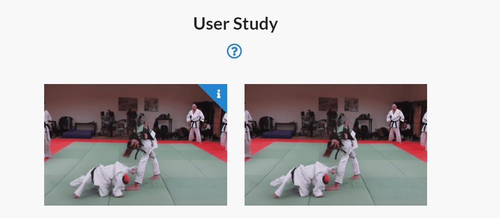
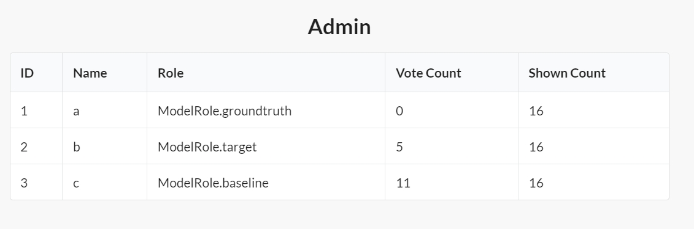

# 🔍 Handy Voting: Choose the Best One (for user study)

This project is used for deploying a simple server for a quick user study.
Currently, we support image, GIF, and video comparison.


## News
* [5/19/2024] Support local comparisons (images/gif) in html.
* [5/19/2024] Support counting voted users in admin page.
* [5/18/2024] Released. Support image, GIF, and video comparison.


## Introduction

This website has two pages, one being the `index` page, and the other the `admin` page.

### Index Page



The index page is for comparing and voting for results. The user is shown a set of results from different models and is asked to vote for the best one. The order shuffles in each trail. The user can vote for the best one by clicking the result.

You can set the details of models for comparison in `config.yaml`. There are three kinds of models:
| Type       | Description                                                               | Optional | Always Shown | Voting Allowed |
|------------|---------------------------------------------------------------------------|----------|--------------|----------------|
| `reference`| It is usually used as a reference, e.g., input/groundtruth. | Yes      | Yes          | No             |
| `target`   | It is usually used as your model. | Yes      | Yes          | Yes            |
| `baseline` | Only a subset of this kind of models are randomly shown to the user in each turn. The number of baseline models to be shown can be set as `NUM_MODELS` in `config.yaml`. | Yes      | No           | Yes            |


### Admin Page



In the admin page, you can find statistics on the votes for different models.
Currently all properties of the `Model` are shown on this page.

Image generating models are modeled as `Model` ORM objects in this project.

Each `Model` has these properties:

* Id.
* Name. Used in looking for the images.
* Type. Can be `reference`, `target`, or `baseline`.
* Vote Count. The count of votes this model has received.
* Shown Count. That's how many times the model is shown to the user.


## Installation

```
git clone git@github.com:zengyh1900/handy_voting.git
cd handy_voting
pip install -r requirements.txt
```

## Quick start

### Prepare the results for user study

1. Link all the results used for user study to the static folder,
```bash
ln -s /path/to/the/results/of/modelA server/data/images/modelA
```
Note that, you can also put the results under `videos` or any other subfolders under `data`. Then, you can set the `DATA_DIR` in `config.yaml` to the corresponding subfolder.

2. Setup your configuration in `config.yaml`.

3. Create the database for user study,
```bash
python create_models.py
```

3. RUN.
```bash
export FLASK_APP=server
export FLASK_ENV=production
flask run --host=0.0.0.0 --port=5050
```

You can now access the index page at `http://localhost:5000`
and the admin page at `http://localhost:5000/admin`.

And, your directory hierarchy should look like:

```
.
├── README.md
├── create_models.py
├── **imgvoter.db**
├── requirements.txt
├── server
│   ├── __init__.py
│   ├── config.py
│   ├── models
│   │   └── ...
│   ├── static
│   │   ├── Semantic-UI-CSS
│   │   ├── css
│   │   ├── data
│   │   │   ├── MODEL1
│   │   │   ├── MODEL2
│   │   │   └── ...
│   │   └── img
│   ├── templates
│   │   └── ...
│   └── views.py
└── t...
```


## Experiments
Before conducting a user study, you may also want to check all the results locally.
Then you can run with,
```shell
python check.py --src path/to/modelA path/to/modelB path/to/modelB --name output
```


Then, setup a simple server by running,
```shell
python -m http.server 8000 --bind 0.0.0.0
```

Then, open your browser and visit `http://localhost:8000/check/output.html` to check the results.
You may find 404 error when you check the results, which is often caused by setting wrong path. I suggest all the results share the same parent directory.


## Credit
original from [@leasunhy](https://github.com/leasunhy)
